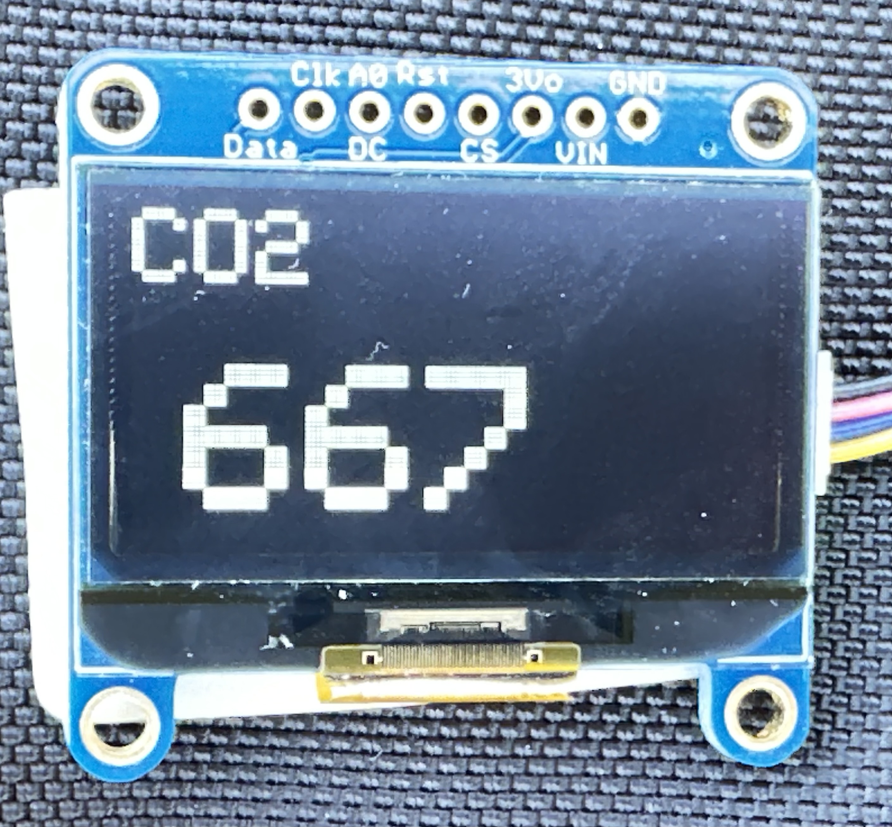
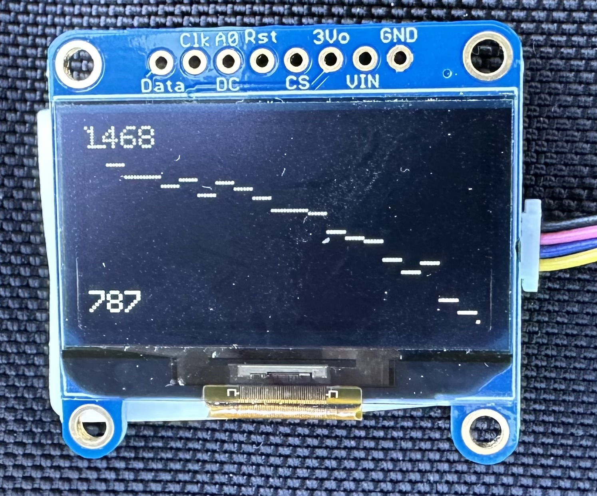

<!--
SPDX-FileCopyrightText: 2023 John Romkey

SPDX-License-Identifier: MIT
-->

# Portable CO2 Monitor

This is a quick hack to throw together a portable CO2 monitor. I'm attending an event and was curious about airflow and ventilation in the rooms. Logging CO2 levels is a helpful way to see if rooms are well ventilated and air is being exchanged.

## Operation

The monitor logs CO2, temperature and humidity readings once every minute and then goes to deep sleep. The ESP32 has a limited amount of memory which persists during deep sleep; the monitor uses this. When this buffer is full, the monitor copies the readings to a CSV file on a SPIFFS filesystem in flash storage and starts over

After taking a reading the monitor shows the current reading and a graph of the 64 most recent readings..

 

(the second photo is missing some of the graph due to display refresh)

## Hardware

- [Unexpected Maker Feather S3 ESP32-S3](https://unexpectedmaker.com/shop/feathers3)
- [Sparkfun Qwiic Sensirion SCD41 CO2 sensor](https://www.sparkfun.com/products/18366)
- [Adafruit Qwiic 128x64 OLED display](https://www.adafruit.com/product/938)

The Unexpected Maker Feather S3 ESP32-S3 is a very nice board that's optimized for saving power. When it deep sleep it automatically switches off power to the second (vertical) Qwiic connector on the board, so if we connect the CO2 sensor and display to that connector we automatically stop powering them in deep sleep. It also uses energy efficient voltage regulators. It's overkill for this project but it was handy and very easy to use.

The SCD41 is a small, energy efficient true CO2 sensor. Yes, it's expensive. The SCD40 is slightly cheaper and would also be fine. Very cheap "CO2" sensors like the CCS811 are not true CO2 sensors - they're volatile organic compound sensors which calculate an estimate of how much CO2 might be present. If you use them outside of the narrow conditions in which they're intended to be operated, they can report wildly inaccurate values. I prefer to use true CO2 sensors.

The SSD1306 OLED display is easy to read and use.

I chose these for ease of use. Qwiic connectors allowed rapid prototyping without soldering or breadboards. As this project is meant to be mobile, breadboard connections would be too unreliable. 

The project doesn't depend on these exact products but might require a bit of work to use different ones.

You can certainly use other ESP32 boards and other sources of displays and CO2 sensors; you'll need to change `platformio.ini` to specify the correct board. If you use a display that's a different resolution than 128x64 or a different controller than SSD1306 then you'll need to rewrite the display code. If you use a CO2 sensor other than SCD40 or SCD41 you'll need to rewrite that code and use a library appropriate to that sensor.

## Software

This is a relatively simple Arduino program built by [PlatformIO](https://platformio.org). To build it, install PlatformIO and run
```
platformio run 
```

To upload it to the ESP32:
```
platformio run -t upload
```

If you're using an ESP32-S2 or ESP32-S3 you might have to put the CPU in download mode by holding the BOOT (or FLASH or GPIO0) button, pressing and releasing the RESET button, and releasing the BOOT button. If the CPU is already running the code and is in deep sleep you may have to wake it up with RESET or with the BOOT/RESET sequence.
